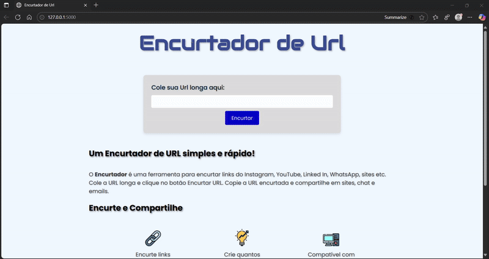

# 🔗 Encurtador de URLs com Flask


Um serviço completo de encurtamento de URLs, desenvolvido com **Python** e **Flask**, utilizando banco de dados **PostgreSQL** hospedado na nuvem. O projeto inclui funcionalidades de redirecionamento e rastreamento de cliques.

## 🚀 Demo Online

O projeto está rodando em produção! Acesse aqui:
👉 **https://encurtador-de-url-8ris.onrender.com**

---

## 📸 Demonstração Visual

<p align="center">
   
</p>

## 📋 Funcionalidades

- **Encurtamento de Links**: Transforma URLs longas em códigos curtos e compartilháveis.
- **Códigos Personalizados**: Permite que o usuário escolha seu próprio sufixo (ex: `meusite.com/googlezinho`).
- **Redirecionamento Rápido**: Redireciona o usuário para a URL original instantaneamente.
- **Contador de Cliques**: Monitora quantas vezes cada link foi acessado.
- **Validações**: Impede URLs inválidas ou códigos duplicados.

---

## 🛠️ Tecnologias Utilizadas

Este projeto foi construído utilizando as seguintes tecnologias:

## 🛠️ Tecnologias Utilizadas

- **Back-end:** Python, Flask
- **Banco de Dados:** - Produção: PostgreSQL (via Neon Tech)
  - Desenvolvimento: SQLite
- **ORM:** SQLAlchemy (manipulação de dados)
- **Servidor WSGI:** Gunicorn
- **Deploy:** Render (PaaS), Git e GitHub

---

## 🗂️ Estrutura do Projeto

```bash
├── controllers.py   # Lógica das rotas (blueprints)
├── models.py        # Modelos do banco de dados (tabelas)
├── app.py           # Configuração principal e inicialização
├── templates/       # Arquivos HTML
├── static/          # Arquivos CSS e Imagens
├── requirements.txt # Dependências do projeto
├── Procfile         # Configuração de inicialização do Render
└── README.md        # Documentação
```

## 🚀 Como Rodar o Projeto Localmente

Siga os passos abaixo para executar o projeto em sua máquina.

**Pré-requisitos:**
* **Python 3.10+**
* **Git**

**Passos:**
1.  **Clone o repositório:**
    ```bash
    git clone [https://github.com/EnioJr18/Encurtador-de-Url.git](https://github.com/EnioJr18/Encurtador-de-Url.git)
    cd Encurtador-de-Url
    ```

2.  **Crie e ative um ambiente virtual:**
    ```bash
    # Para Windows
    python -m venv venv
    .\venv\Scripts\activate

    # Para macOS/Linux
    python3 -m venv venv
    source venv/bin/activate
    ```

3.  **Instale as dependências:**
    ```bash
    pip install -r requirements.txt
    ```

4. **Configure as variáveis de ambiente**
Crie um arquivo ```.env (opcional)``` ou exporte as variáveis no terminal. Se não configurar, o projeto usará o SQLite localmente por padrão.


5.  **Execute a aplicação:**
    ```bash
    flask run
    ```

6.  Abra seu navegador e acesse `http://127.0.0.1:5000`.

## 📄 Licença
Este projeto está sob a licença MIT. Sinta-se à vontade para usar e modificar.

## 👨‍💻 Autor
Desenvolvido por Enio Jr como parte de um portfólio de Engenharia de Software Backend.

📧 Entre em contato: eniojr100@gmail.com <br>
🔗 LinkedIn: https://www.linkedin.com/in/enioeduardojr/ <br>
📷 Instagram: https://www.instagram.com/enio_juniorrr/ <br>
